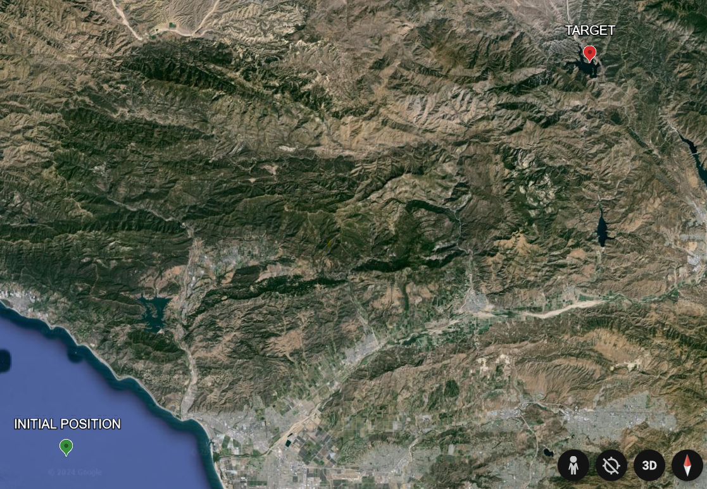
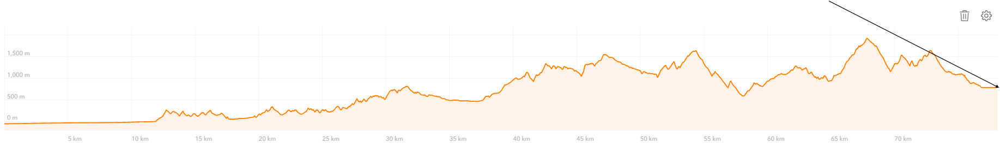
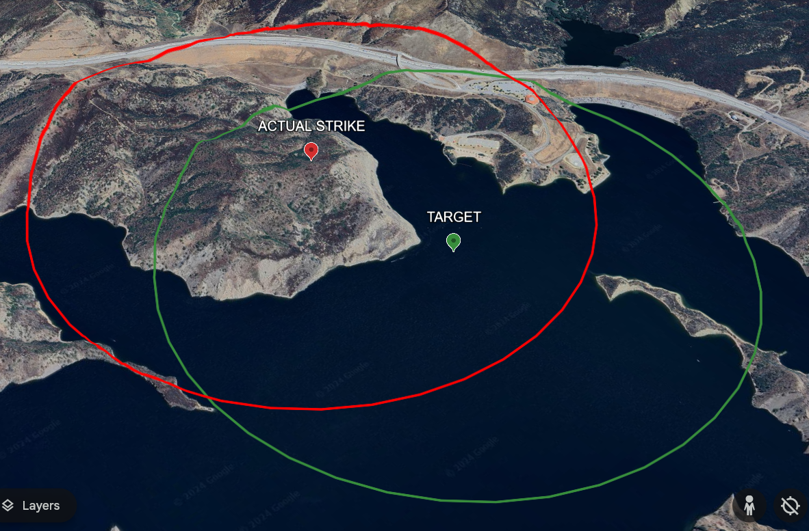

# Missile guidance system #

In this project the airstrike is simulated.
All the coordinates are in degrees, distances in meters.

The missile's initial location in the example provided is:
```
LAT_INIT = 34.2329;
LON_INIT = -119.4573;
ELEV_INIT = 10000;
```

While the target's location is:
```
LAT_TARGET = 34.6588;
LON_TARGET = -118.769745;
ELEV_TARGET = 795;
```

The mentioned characteristics are specified in MATLAB file along with the state space matrices describing the rocket.
Kalman filter and LQR matrices are also described in the file.

On the map, these points look the following way:
<p>
  
</p>

The task might seem clear at this point, however we have to account for terrain.
This is the elevation profile along the path of the missile, with the path segment in black:
<p>
  
</p>

It is noticeable that missile trajectory "slashes" the terrain segment, we cannot allow for that.
For that reason, obstacle evasion was added.

To simulate the reading error the noise was also introduced into the system.
As a result, due to the existance of the noise, missile does not hit the target with 100% precision. 

The whole striking process is realized in Simulink.

Now we can assess the accuracy. During that process, 1km blast radius is assumed.

To do this, we have to divide intersecting area by the area of the circle:
<p>
  
</p>
The accuracy in our example is 63.5%.
This part is implemented in Python.

As the strike progresses we can observe several variables:
Real(yellow) and commanded(blue) flight path angle and height.
https://github.com/Arseni10Lk/Missile-guidance-system/blob/main/Video.mp4
